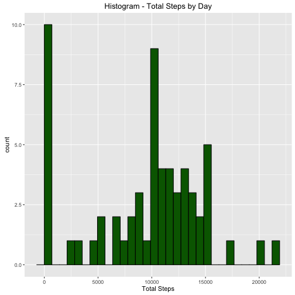
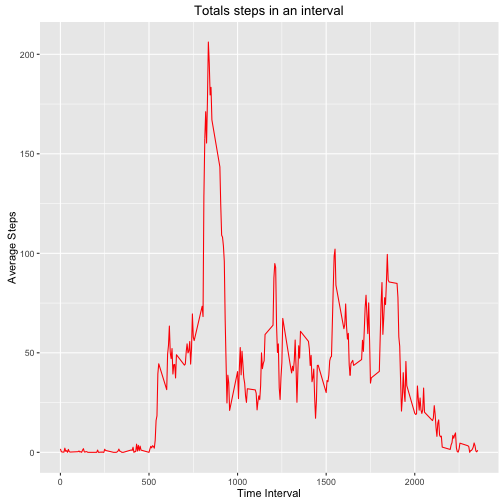
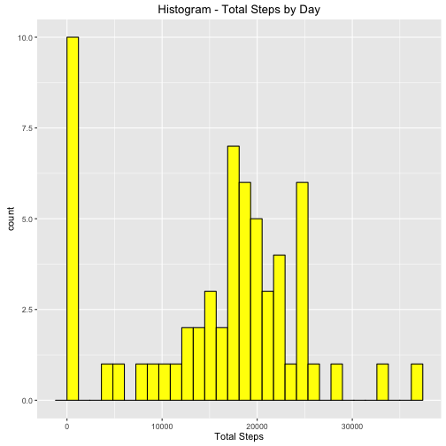
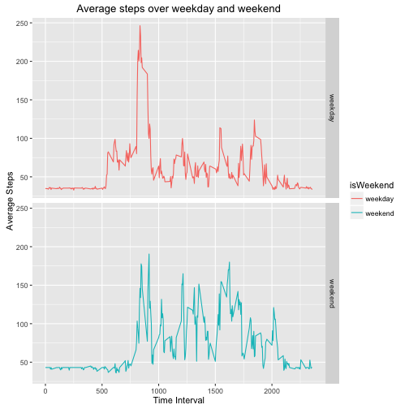

## Loading and preprocessing the data


```r
# Read in the csv files
activity_data <- read.csv('activity.csv')
```


```r
#preprocessing data
activity_data <- activity_data %>% 
                 #convert date field from charcter to date
                 mutate(date = as.Date(date))
```


## What is mean total number of steps taken per day?

```r
grouped_byday <- activity_data %>% group_by(date)
steps_byday <- summarize(grouped_byday, 
                         total_steps = sum(steps,na.rm=T), 
                         mean_steps = mean(steps,na.rm=T), 
                         median_steps = median(steps,na.rm=T) )

#plot
g <- ggplot(steps_byday, aes(x=total_steps,na.rm=T))

g + geom_histogram(color="black", fill="darkgreen", na.rm=T) + 
    ggtitle('Histogram - Total Steps by Day') +
    xlab("Total Steps")
```

 

Mean of total steps is 9354.2295082

Median of total steps is 10395


## What is the average daily activity pattern?

```r
grouped_byinterval <- activity_data %>% group_by(interval)

steps_byinterval <- summarize(grouped_byinterval, 
                          avg_steps = mean(steps,na.rm=T))
#plot
h <- ggplot(steps_byinterval, aes(x=interval,y=avg_steps))
h + geom_line(color="red") + 
    ggtitle("Totals steps in an interval") + 
    xlab("Time Interval") + 
    ylab("Average Steps")
```

 


```r
max_index = which.max(steps_byinterval$avg_steps)
max_interval = steps_byinterval[max_index,'interval']
```

Time interval with max average steps = 835

## Imputing missing values


```r
n_missing = sum(!complete.cases(activity_data$steps))
```
Total number of missing values = 2304


```r
#Missing values  in data is replaced with mean value of the day
#initialize activity_imputed with 
#original data
activity_imputed <- activity_data

#replace NAs with '-1'
activity_imputed[is.na(activity_imputed$steps),'steps'] <- 0

#define a function to return
#mean for that day
getmean <- function(d) { 
    steps_byday %>% filter(date==d) %>% select(mean_steps)                     
}

#iterate through each record
for(index in 1:nrow(activity_data)) {
    
    #Get steps
    mysteps <-  activity_imputed[index,'steps']
    #Get date
    mydate <- activity_imputed[index,'date']
    #if mysteps==0 replace with mean value 
    #else replace with actual value
    activity_imputed[index,'steps'] <- ifelse(mysteps==0,
                                              getmean(mydate),mysteps)
}
#Missing steps is zero now
n_missing_imputed <- sum(complete.cases(activity_imputed))
```
Total number of missing values in imputed data = 15264


```r
grouped_byday_imputed <- activity_imputed %>% group_by(date)
steps_byday_imputed <- summarize(grouped_byday_imputed, 
                         total_steps = sum(steps,na.rm=T), 
                         mean_steps = mean(steps,na.rm=T), 
                         median_steps = median(steps,na.rm=T) )

#plot
g <- ggplot(steps_byday_imputed, aes(x=total_steps,na.rm=T))

g + geom_histogram(color="black", fill="yellow", na.rm=T) + 
    ggtitle('Histogram - Total Steps by Day') +
    xlab("Total Steps")
```

 

Mean of total steps is 9354.2295082

Median of total steps is 10395

Mean and median hasn't changed in imputed data set.

## Are there differences in activity patterns between weekdays and weekends?


```r
activity_imputed <- activity_imputed %>%
                    #Add weekday to it 
                    mutate(weekday=weekdays(date,abbreviate=T)) %>%
                    #Add factor variable isWeekend
                    mutate(isWeekend=ifelse(weekday=="Sat"|weekday=="Sun",'weekend','weekday'))
```


```r
grouped_byinterval_imputed <- activity_imputed %>% group_by(interval)

#for weekend
steps_byinterval_weekend <- grouped_byinterval_imputed %>%
                            filter(isWeekend=='weekend') %>%    
                            summarize(avg_steps = mean(steps,na.rm=T)) %>%
                            mutate(isWeekend='weekend')
#for weekday
steps_byinterval_weekday <- grouped_byinterval_imputed %>%
                            filter(isWeekend=='weekday') %>%    
                            summarize(avg_steps = mean(steps,na.rm=T)) %>%
                            mutate(isWeekend='weekday')

steps_byinterval_imputed <- rbind(steps_byinterval_weekend,steps_byinterval_weekday)

#plot
h <- ggplot(steps_byinterval_imputed, aes(x=interval,y=avg_steps))
h + geom_line(aes(color=isWeekend)) + 
    ggtitle("Average steps over weekday and weekend") + 
    xlab("Time Interval") + 
    ylab("Average Steps") +
    facet_grid(isWeekend ~ .)
```

 


